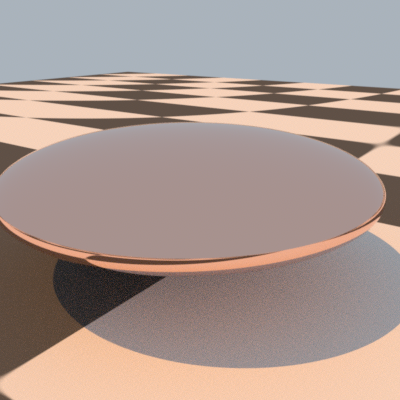
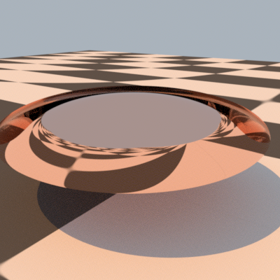

# 1

The axis-aligned bounding boxes are characterised by
- The origin $o$ (the corner with the minimal coordinates, that actually corresponds to the public member pMin of the Bounds3 object)
- 3 side measure ($l_x, l_y, l_z>0$). They corresponds the coordinates of the vector pMax-pMin

The 8 corners can be defined as;
$$
p^{i,j,k} = o + i l_x e_x + jl_y e_y + kl_z e_z,
$$
where $e_x,e_y,e_z$ are the canonic unit vectors, and $i,j,k\in\{0,1\}^3$.
Given a transformation matrix $T$, we want to find $p^{\prime}_0$ such that
$$
o^\prime = \begin{pmatrix}
\min_{i,j,k}\{Tp^{i,j,k}\cdot e_x\} \\
\min_{i,j,k}\{Tp^{i,j,k}\cdot e_y\} \\
\min_{i,j,k}\{Tp^{i,j,k}\cdot e_z\} \\
1
\end{pmatrix}
$$

Let's start to develop $o^\prime_x$:
$$
o^\prime_x = \min_{i,j,k}\{Tp^{i,j,k}\cdot e_x\} = \min_{i,j,k}\{T_{0,0}p^{i,j,k}_x + T_{0,1}p^{i,j,k}_y+T_{0,2}p^{i,j,k}_z+T_{0,3}\} \\=
\min_{i,j,k}\{T_{0,0}(o_x+il_x) + T_{0,1}(o_y+jl_y)+T_{0,2}(o_z+kl_z)\}+T_{0,3} \\=
\min_{i,j,k}\{T_{0,0}il_x + T_{0,1}jl_y+T_{0,2}kl_z\}+To\cdot e_x \\=
\min_i\{iT_{0,0}l_x\} + \min_j\{jT_{0,1}l_y\}+\min_k\{kT_{0,2}l_z\}+To\cdot e_x
$$
Since $l_x,l_y,l_z$ are positive, the min depends on the sign of the $T$ coefficient. Let's call $T^+$, a version of $T$ where each negative coefficient is forced to $0$, and $T^-$ where each negative coefficient is forced to 1. Then, developping $o^\prime_y$ and $o^\prime_z$ reveals that
$$
o^\prime = T^-\begin{pmatrix}
l_x\\
l_y\\
l_z\\
0
\end{pmatrix}
+To =
T^-(q-o)+To = T^-q + (T-T^-)o = T^-q + T^+o
$$
A similar developpment for the point $q^\prime$ (that correspond to pMax in the code, i.e the vertex with the maximum coordinates) yields the expression
$$
q^\prime = T^+\begin{pmatrix}
l_x\\
l_y\\
l_z\\
0
\end{pmatrix}
+To = 
T^+(q-o)+To = T^+q + (T-T^+)o = T^+q + T^-o .
$$

We will write the code as a for-loop, iterating on the coefficients of $T$ so let's see what happens under the hood for one couple $i,j$:
- If $T[i,j] \geq 0$, then $T[i,j]o[j]$ is added to $o^\prime[j]$ and $T[i,j]q[j]$ to $q^\prime[j]$.
- Else, then $T[i,j]o[j]$ is added to $q^\prime[j]$ and $T[i,j]q[j]$ to $o^\prime[j]$.

Both of these quantities must therefore necessarily be computed at each iteration, but they are added to a different buffer depending on the sign of $T[i,j]$. This could typically be implemented by a conditional move at each iteration, but interestingly, this sign condition can be expressed differently! Since, by definition, $q[j]\geq o[j]$ for any $j$, then $T[i,j] \geq 0$ is equivalent to $T[i,j]q[j]\geq T[i,j]o[j]$. This conditional move can cleverly be replaced by min and max operators, as is done in the algorithm proposed in the Graphics Gems I. This requires to make the same comparison twice which may sound less optimised than the conditional move, but min and max operations are very presumably better fitted for vectorisation.

It is also worth noting that the final column of $T$ is a special case: The 4th component of both $q$ and $o$ is 1, so $T[i,j]$ is added to the both buffers regardless of its sign. This is why I have put this part out of the loop in my implementation, and delegated this cost directly to the constructor.

Here is my final implementation:
```c++
PBRT_CPU_GPU Bounds3f Transform::operator()(const Bounds3f &b) const {
    Bounds3f bt;
    // Initialize with the translation component directly, instead of adding at the end.
    Point3f pMin_new {m[0][3], m[1][3], m[2][3]};
    Point3f pMax_new {m[0][3], m[1][3], m[2][3]};

    for (uint i = 0; i < 3; ++i) {
        for (uint j = 0; j < 3; ++j) {
            Float mpmin = m[i][j] * b.pMin[j];
            Float mpmax = m[i][j] * b.pMax[j];
            pMin_new[i] += std::min(mpmin, mpmax);
            pMax_new[i] += std::max(mpmin, mpmax);
        }
    }
    bt.pMin = pMin_new;
    bt.pMax = pMax_new;

    return bt;
}
```

However, it may not be worth the troubles to add this implementation in the code ; I don't think bounding box transforms take a relevant amount of time during rendering.

# 2 TODO

# 3

Let's try to understand the issue with the naive approach. A simple drawing is worth a thousand words:


We can directly see the problem in this toy example : The smallest 3D sphere that contains the bounding box can be far from optimal to compute the cone. It should be more noticeable when the bounding box is unbalanced and when the perspective is oriented in the longest axis. 

To fix that, we need a way to compute a more precise cone. I will implement the optimal cone computation because I find the math and the algorithm fun. This can actually be solved using the Welzl smallest enclosing disk algorithm (2001), which I will detail.


The issue can be posed as follows: we have a point $p$ representing the tip of the cone, and a list of (8) points $q_i$ that represent the corners of the box. From this, we define the vectors $v_i=\frac{q_i-p}{\|q_i-p\|}$ that are just the projections on the unit sphere. A cone is defined by its central direction $v$ (a unit vector) and its spread angle $\theta$. Our mission is to find $v$ and the smallest $\theta$ possible such that all the $v_i$ are in the cone.

There is actually a clever way to do that with a linear time on average: the Welzl algorithm. However I empirically found that it was not worth it for such a small number of points. We can bruteforce the problem and inspect all the unique couples of $v_i$ to find the biggest angle, and deduce $\theta$ and $v$. In our case, it represents $8\times7/2=28$ checks.

<!-- Welzl came up with a clever efficient recursive algorithm to compute the smallest circle that contains an arbitrary list of points. The recursion idea is the following: if $C_n$ is the circle that contains all the $\{v_i\}_{i<n}$ how to find $C_{n+1}$, the circle that contain all the all the $\{v_i\}_{i<n+1}$? The trick is the following:
- If $v_{n+1}\in C_n$, then $C_{n+1}=C_n$: the previous circle already englobes the new point.
- If $v_{n+1}\notin C_n$, then $C_{n+1}$ will necessarily have $v_n$ on its border (see Note 1). With this constraint, parse through every $\{v_i\}_{i<n+1}$ and build circles that intersect with $v_{n+1}$ until dinfing one that works.

**Note 1:** While being intuitive, I find the proof a bit tricky. It is true because there are 3 points $a^1_n, a^2_n, a^3_n\in \{v_i\}_{i<n}$ that parametrise $C_n$ (remember that there is only 1 circle that passes through 3 given points). So if $v_{n+1}$ isn't on the border of $C_{n+1}$, it means that $v_{n+1}\notin \{a^1_{n+1}, a^2_{n+1}, a^3_{n+1}\}$. But since $C_{n+1}$ contains all the $\{v_i\}_{i<n}$ (as well as $v_{n+1}$), and that it verifies $a^1_{n+1}, a^2_{n+1}, a^3_{n+1}\in \{v_i\}_{i<n}$, it implies that $C_{n+1}=C_n$: both circles are identical. In other words, $v_{n+1}\notin C_n$ if and only if $C_{n+1}\neq C_n$ and $v_{n+1}$ is on the border of $C_{n+1}$.

The trick of Wezlz is to randomise the order of the point before running the algorithm. -->

We first need to discard the case where $p$ is inside the box. In this case the cone is the unit sphere so we skip the whole computation. Next, we have to compute the angles $\cos{\psi_{ij}}=v_i\cdot v_j$. Note that we search a cone, so $0\leq\psi_{ij}\leq\pi$ and therefore $\psi_{ij}=\arccos{v_i\cdot v_j}$. In practice we have to find $i_{min},j_{min}=\argmin_{ij}(v_i\cdot v_j)$,
which gives us $\psi_{ij}$ and $v=\frac{1}{2}(v_i+v_j)$. Here is the code
```c++
PBRT_CPU_GPU inline DirectionCone BoundSubtendedDirections(const Bounds3f &b, Point3f p) {
    if (Inside(p, b))
        return DirectionCone::EntireSphere();

    Vector3f vi_min, vj_min;
    Float minDot = Infinity;
    for (uint ci = 0; ci < 8; ++ci) {
        Vector3f vi = Normalize(p - b.Corner(ci));
        for (uint cj = 0; cj < ci; ++cj) {
            Vector3f vj = Normalize(p - b.Corner(cj));
            Float dotij = Dot(vi, vj);
            if (dotij < minDot) {
                minDot = dotij;
                vi_min = vi;
                vj_min = vj;
            }
        }
    }
    Vector3f w = Normalize(0.5f * (vi_min + vj_min));

    return DirectionCone(w, Dot(w, vi_min));
}
```

## TODO: test the code. I need more understanding of where this conic bound is used precisely, to highlight a case where it makes a big difference.

# 4
Finding a transform for which the error is visible can be tricky. Translations are unaffected, because the function doesnt even manipulates the 4th column of the $T$ transform (which would correspond to the translation component). Rotations are unaffected because a rotation matrix verifies $R^{-1}=R^T$. The only candidate left is the scaling: instead of being scaled by $s_i^-1$, each component is scaled by $s_i$. The effect won't be noticeable if the scale is comparable in all 3 axes, because the vector is normalised. Hence, I took the example of a metallic sphere that is shrinked vertically. We can clearly see that the result is incoherent: the ground is reflected on the top of the sphere. With the correct function, only the sky is reflected on the top.




Here is the scene description:

```julia
LookAt 3 4 1.5  # eye
       .5 .5 0  # look at point
       0 0 1    # up vector
Camera "perspective" "float fov" 45

Sampler "halton" "integer pixelsamples" 128
Integrator "volpath"
Film "rgb" "string filename" "simple.png"
     "integer xresolution" [400] "integer yresolution" [400]

WorldBegin

# uniform blue-ish illumination from all directions
LightSource "infinite" "rgb L" [ .4 .45 .5 ]

# approximate the sun
LightSource "distant"  "point3 from" [ -30 40  100 ]
   "blackbody L" 3000 "float scale" 1.5

AttributeBegin
  Scale 2 2 0.5
  Material "conductor"
  Shape "sphere" "float radius" 1
AttributeEnd

AttributeBegin
  Texture "checks" "spectrum" "checkerboard"
          "float uscale" [16] "float vscale" [16]
          "rgb tex1" [.1 .1 .1] "rgb tex2" [.8 .8 .8]
  Material "diffuse" "texture reflectance" "checks"
  Translate 0 0 -1
  Shape "bilinearmesh"
      "point3 P" [ -20 -20 0   20 -20 0   -20 20 0   20 20 0 ]
      "point2 uv" [ 0 0   1 0    1 1   0 1 ]
AttributeEnd
```